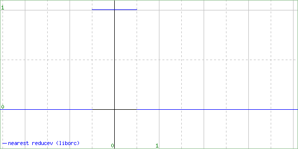

# libvips issue #2047

Test case for [libvips/libvips#2047](https://github.com/libvips/libvips/discussions/2047).

## Run

```console
$ ./resamplescope.sh
```

See [output/](output) directory.

## Output

### nearest

| C | liborc | Comparison |
| :---: |  :---: |  :---: |
|  |  |  |

### linear

| C | liborc | Comparison |
| :---: |  :---: |  :---: |
|  |  |  |

### cubic

| C | liborc | Comparison |
| :---: |  :---: |  :---: |
|  |  |  |

### mitchell

| C | liborc | Comparison |
| :---: |  :---: |  :---: |
|  |  |  |

### lanczos2

| C | liborc | Comparison |
| :---: |  :---: |  :---: |
|  |  |  |

### lanczos3

| C | liborc | Comparison |
| :---: |  :---: |  :---: |
|  |  |  |
